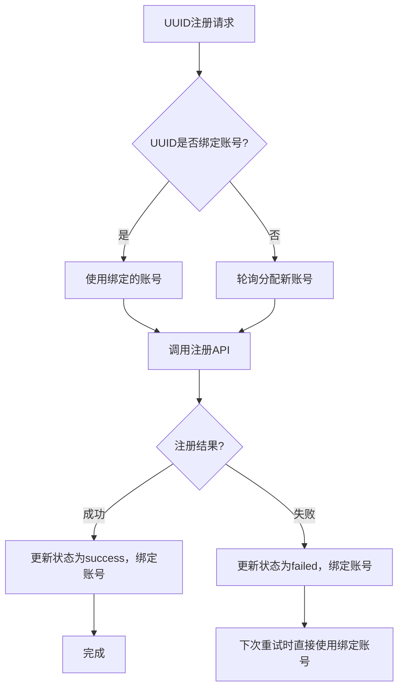

# EarnAPP 设备注册API服务

EarnAPP 平台设备注册自动化工具，基于官方接口二次封装，提供标准化API服务，支持多账号轮询注册，解决批量注册场景下的稳定性、可靠性问题，尤其适配失败UUID固定账号重试的业务需求。

## 核心优势

| 特性       | 说明                                             |
|----------|------------------------------------------------|
| 🔒 接口鉴权  | 支持 Bearer Token / 自定义 Header Token 双重鉴权，防止接口滥用 |
| 👥 多账号轮询 | 支持多账号配置轮询注册，失败UUID固定使用原账号重试，避免账号切换导致的注册失败      |
| 🚀 异步处理  | UUID 加入队列异步串行处理，避免接口阻塞，支持批量提交                  |
| 🔄 智能重试  | 429限流/网络异常自动重试（最大2次），固定调用间隔防限流                 |
| 💾 状态持久化 | UUID 处理状态+绑定账号本地持久化，服务重启不丢失历史数据                |
| 🚨 异常告警  | 按账号维度监控Token过期（连续3次403），自动推送QQ告警，服务启动也会推送通知    |
| 🔍 状态查询  | 支持查询单个UUID处理状态+绑定账号（成功/失败/处理中/队列中）             |
| ⚡ 幂等设计   | 已成功/处理中的UUID重复提交自动过滤，避免重复处理                    |

## 快速部署

### 环境准备

#### 核心配置文件（必填）

服务依赖 `/data/config.yaml` 配置文件，支持多账号配置：

```yaml
# 全局配置 - 所有账号默认使用
global:
  # 全局认证令牌
  auth_token: "AUTH_TOKEN_XXXXXX"

# 多账号列表 - 每个账号独立配置Cookie
accounts:
  - name: account-01
    cookie:
      # 浏览器F12获取
      xsrf_token: "XSRF_TOKEN_01_XXXX"
      brd_sess_id: "BRD_SESS_ID_01_XXXX"
  - name: account-02
    cookie:
      xsrf_token: "XSRF_TOKEN_02_XXXX"
      brd_sess_id: "BRD_SESS_ID_02_XXXX"

# 告警配置 - 全局生效
alarm:
  # 告警总开关：true=开启，false=关闭
  enabled: true
  # QMSG推送配置（QQ消息告警）
  qmsg:
    token: "QMSG_TOKEN_XXXXXX"
    qq: "1234567890" # 接收告警的QQ号
    bot_id: "BOT_ID_XXXX" # 推送机器人ID

# 代理配置 - 全局生效
proxy:
  host: "proxy.example.com" # 代理服务器地址
  port: 3010 # 代理端口（数字类型）
  # 代理账号模板（{RND:8} 表示生成8位随机数）
  user_template: "user-prefix-{RND:8}-suffix-XXXX"
  # 代理密码
  password_template: "PROXY_PWD_XXXXXX"
  # 生成随机数的字符集（字母+数字）
  random_charset: abcdefghijklmnopqrstuvwxyz0123456789
```

#### 配置参数说明

| 配置项                       | 层级                | 必填 | 说明                                         |
|---------------------------|-------------------|----|--------------------------------------------|
| `auth_token`              | global            | ✅  | 自定义字符串，用于接口鉴权，防止接口滥用                       |
| `accounts[].name`         | accounts          | ✅  | 账号名称（自定义，用于日志/告警区分）                        |
| `xsrf_token`              | accounts[].cookie | ✅  | 登录EarnAPP官网 → F12开发者工具 → 应用 → Cookie中获取    |
| `brd_sess_id`             | accounts[].cookie | ✅  | 同上                                         |
| `alarm.enabled`           | alarm             | ❌  | 告警总开关，true=开启，false=关闭                     |
| `qmsg.token`              | alarm.qmsg        | ❌  | QMSG机器人Token（获取地址：https://qmsg.zendee.cn/） |
| `qmsg.qq`                 | alarm.qmsg        | ❌  | 接收告警的QQ号                                   |
| `qmsg.bot_id`             | alarm.qmsg        | ❌  | QMSG机器人ID（默认填12345即可）                      |
| `proxy.host`              | proxy             | ❌  | 代理服务器地址                                    |
| `proxy.port`              | proxy             | ❌  | 代理服务器端口（数字类型）                              |
| `proxy.user_template`     | proxy             | ❌  | 代理账号模板，支持{RND:N}随机字符串占位符（如{RND:8}生成8位随机数）  |
| `proxy.password_template` | proxy             | ❌  | 代理密码模板，支持{RND:N}随机字符串占位符                   |
| `proxy.random_charset`    | proxy             | ❌  | 随机字符集（默认：字母+数字）                            |

### Docker部署（推荐）

```bash
# 1. 编辑配置文件
mkdir -p /opt/earnapp/data
vim /opt/earnapp/data/config.yaml

# 2. 启动容器
docker run -d \
  -p 5000:5000 \
  --name earnapp-api \
  --restart=always \
  -v /opt/earnapp/data:/data \  # 挂载数据目录
  fogforest/earnapp-api
```

### 手动部署

```bash
# 1. 环境准备
python -m venv venv
source venv/bin/activate  # Windows: venv\Scripts\activate
pip install flask requests pyyaml

# 2. 配置文件
mkdir -p /data
vim /data/config.yaml  # 写入上述配置内容

# 3. 启动服务
python main.py
```

## 接口文档

### 1. 注册UUID（核心接口）

提交UUID到处理队列，异步串行处理，失败UUID重试时固定使用原账号。

**请求地址**：`POST /api/register`  
**请求头**：

- Content-Type: application/json
- Authorization: Bearer {AUTH_TOKEN} （或 X-Auth-Token: {AUTH_TOKEN}）

**请求体**：

```json
{
  "uuid": "sdk-node-7a3b43f516a3490d8ba4c3d459bb34b1"
}
```

### 2. 查询UUID状态

查询指定UUID的处理状态+绑定账号，便于跟踪失败UUID的账号归属。

**请求地址**：`GET /api/uuid/status/{uuid}`  
**请求头**：

- Authorization: Bearer {AUTH_TOKEN} （或 X-Auth-Token: {AUTH_TOKEN}）

### 3. 健康检查

查看服务运行状态，无需鉴权。

**请求地址**：`GET /api/health`

## 响应说明

### 通用响应格式

```json
{
  "code": 0,
  "message": "描述信息",
  "data": {}
}
```

### 详细响应示例

| 场景        | HTTP状态码 | 响应示例                                                                                                                              |
|-----------|---------|-----------------------------------------------------------------------------------------------------------------------------------|
| UUID已成功注册 | 200     | `{"code":0,"message":"UUID already registered successfully","data":{"uuid":"xxx","status":"success","account":"account-01"}}`     |
| UUID已入队等待 | 200     | `{"code":0,"message":"UUID received, processing will start shortly","data":{"uuid":"xxx","queue_position":1,"status":"pending"}}` |
| UUID正在处理  | 200     | `{"code":0,"message":"UUID current status: processing","data":{"uuid":"xxx","status":"processing","account":"account-01"}}`       |
| 重复提交UUID  | 200     | `{"code":1004,"message":"UUID is already in processing queue","data":{"uuid":"xxx","status":"in_queue"}}`                         |
| 参数缺失      | 400     | `{"code":1001,"message":"Parameter error, missing required UUID field"}`                                                          |
| 鉴权失败      | 401     | `{"code":1002,"message":"Invalid authentication token"}`                                                                          |
| UUID不存在   | 404     | `{"code":1003,"message":"UUID not found"}`                                                                                        |

### UUID状态查询响应示例

```json
{
  "code": 0,
  "message": "UUID status query successful",
  "data": {
    "status": "failed",
    // success/failed/processing/pending
    "message": "Account account-01 Token expired",
    "account": "account-01"
    // 绑定的账号名称
  }
}
```

### 健康检查响应示例

```json
{
  "code": 0,
  "message": "Service is running normally",
  "data": {
    "service": "earnapp-uuid-register",
    "status": "running",
    "timestamp": "2026-03-07 16:00:00",
    "queue_size": 5,
    "queue_unique_count": 5,
    "recorded_uuids": 120,
    "proxy_configured": true,
    "account_count": 2,
    // 配置的账号数量
    "alarm_enabled": true
    // 告警开关状态
  }
}
```

## 告警说明

配置QMSG参数后，程序会按**账号维度**触发以下告警：

1. **Token过期告警**：单个账号连续3次API返回403错误（Token过期），自动推送QQ告警，触发后不再重复推送
2. **服务启动通知**：服务启动时推送基础配置信息（账号数量、代理状态、告警开关等），确认服务正常运行

## 使用示例

### 注册UUID

```bash
# Bearer Token方式（推荐）
curl -X POST http://127.0.0.1:5000/api/register \
  -H "Content-Type: application/json" \
  -H "Authorization: Bearer your_auth_token" \
  -d '{"uuid": "sdk-node-7a3b43f516a3490d8ba4c3d459bb34b1"}'

# 自定义Header Token方式
curl -X POST http://127.0.0.1:5000/api/register \
  -H "Content-Type: application/json" \
  -H "X-Auth-Token: your_auth_token" \
  -d '{"uuid": "sdk-node-7a3b43f516a3490d8ba4c3d459bb34b1"}'
```

### 查询UUID状态

```bash
curl -X GET http://127.0.0.1:5000/api/uuid/status/sdk-node-7a3b43f516a3490d8ba4c3d459bb34b1 \
  -H "Authorization: Bearer your_auth_token"
```

### 健康检查

```bash
curl -X GET http://127.0.0.1:5000/api/health
```

## 核心固定配置说明

以下参数为代码内置固定值，如需调整需修改源码后重新部署：

| 参数名                            | 固定值 | 说明                        |
|--------------------------------|-----|---------------------------|
| `API_CALL_INTERVAL`            | 5秒  | 每次API调用间隔，防止触发频率限制        |
| `MAX_PROXY_RETRY_COUNT`        | 2次  | 遇到429限流错误时的最大重试次数         |
| `TOKEN_EXPIRE_ALERT_THRESHOLD` | 5次  | 单个账号连续403错误触发Token过期告警的阈值 |

## 核心业务逻辑

### 多账号轮询+失败重试机制



## 常见问题

### Q1: 失败UUID如何重新处理？

直接重新调用注册接口即可，程序会自动复用原绑定账号，无需额外配置。

### Q2: 如何更新单个账号的Token？

修改`config.yaml`中对应账号的`xsrf_token`和`brd_sess_id`，重启服务后，该账号绑定的UUID会自动使用新Token处理。

### Q3: UUID状态文件存储位置？

状态文件存储在`/data/uuid_status.json`，采用原子写入机制防止文件损坏，Docker部署时需挂载数据卷避免丢失。

### Q4: 多账号配置有数量限制吗？

无数量限制，可根据业务需求配置任意数量账号，程序会自动轮询分配。

### Q5: 代理配置支持哪些类型？

支持HTTP/HTTPS代理，支持动态账号（通过{RND:N}生成随机字符串），适配各类代理认证场景。

## 响应码速查表

| 响应码  | 含义               |
|------|------------------|
| 0    | 成功               |
| 1001 | 参数错误             |
| 1002 | 未授权（Token错误/未提供） |
| 1003 | UUID不存在          |
| 1004 | UUID已在队列中        |
| 9999 | 系统错误             |

### 总结

1. 核心升级：新增多账号轮询+失败UUID固定账号重试机制，适配批量注册场景下的账号隔离需求；
2. 配置方式：从环境变量改为YAML配置文件，支持多账号、精细化配置，更易维护；
3. 状态增强：UUID状态新增绑定账号字段，可查询每个UUID对应的注册账号，便于问题排查；
4. 告警优化：按账号维度监控Token过期，精准定位过期账号，提升运维效率；
5. 部署兼容：保留Docker/手动部署方式，配置文件挂载即可使用，无需修改核心代码。
